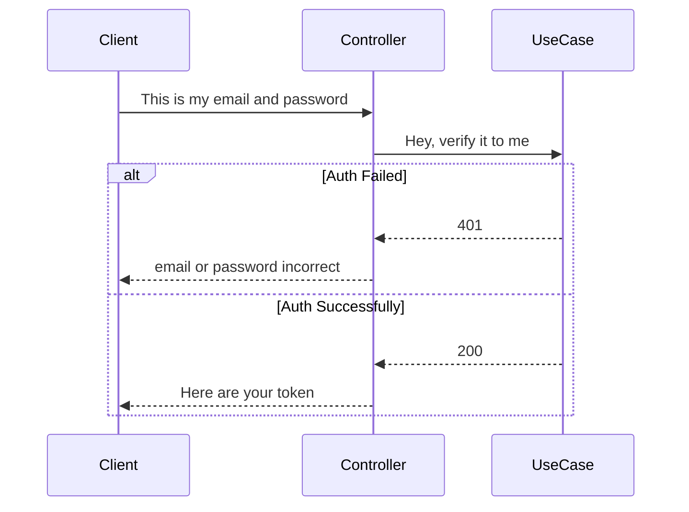

# Authenticate User Controller

```mermaid
sequenceDiagram
    participant Client
    participant Controller
    participant UseCase
    Client ->> Controller: This is my email and password
    Controller ->> UseCase: Hey, verify it to me
    alt Auth Failed
        UseCase -->> Controller: 401
        Controller -->> Client: email or password incorrect
    else Auth Successfully
        UseCase -->> Controller: 200
        Controller -->> Client: Here are your token
    end

```